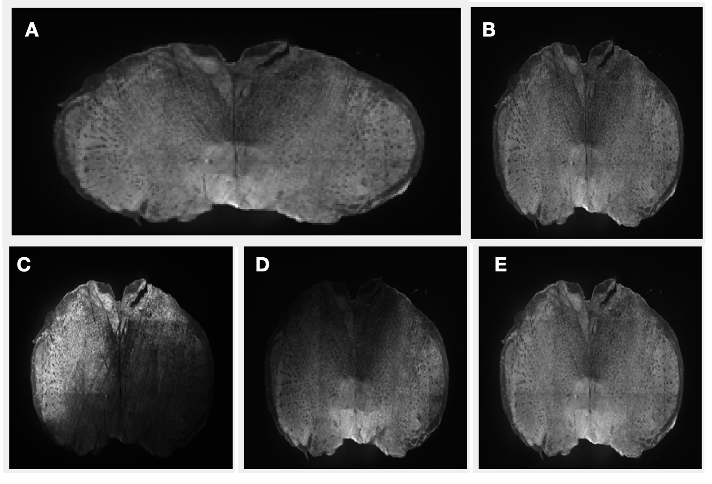

# nRIM_ConfocalToolbox

A collection of tools developed by the nRIM lab for analyzing confocal microscopy data. This toolbox focuses on alignment, morphometric analysis, and generating overview sheets for whole-slide images. Mostly MatLAB.

## Table of Contents

- [nRIM\_ConfocalToolbox](#nrim_confocaltoolbox)
  - [Table of Contents](#table-of-contents)
  - [Getting Started](#getting-started)
    - [Prerequisites](#prerequisites)
      - [Bio-Formats tools](#bio-formats-tools)
      - [MATLAB toolboxes](#matlab-toolboxes)
      - [Other packages:](#other-packages)
    - [Installation](#installation)
  - [Components](#components)
    - [FileHandling](#filehandling)
      - [importZeissStack.m](#importzeissstackm)
      - [getZeissMetadata.m](#getzeissmetadatam)
    - [Visualization](#visualization)
      - [makeSlideOverviewFromFile.m](#makeslideoverviewfromfilem)
      - [makeSlideOverviewPlot.m](#makeslideoverviewplotm)
      - [Generating Thumbnails from Image Stacks](#generating-thumbnails-from-image-stacks)

## Getting Started

These instructions will get you a copy of the project up and running on your local machine for development and testing purposes. 

### Prerequisites
#### Bio-Formats tools
Currently only ZEISS CZI files are supported. 
The functions make use of the Bio-Formats library, which can be downloaded from [here](https://github.com/Biofrontiers-ALMC/bioformats-matlab).
Alternatively, you can find the library via the MATLAB Add-On Explorer. If you have trouble, try finding help [here] (https://github.com/Biofrontiers-ALMC/bioformats-matlab/wiki/getting-started#installation).

Note that when you use the Bio-Formats library for the first time, the most updated library will be automatically downloaded.

#### MATLAB toolboxes
What things you need to install the software and how to install them:

```text
MATLAB (R2023a or newer recommended)
Image Processing Toolbox
Signal Processing Toolbox
Statistics and Machine Learning Toolbox
```

#### Other packages:

we use bfmatlab, a MATLAB toolbox for reading and writing Bio-Formats data in MATLAB.
The code is included in this toolbox under libraries/bfmatlab. More info can be found [here](https://docs.openmicroscopy.org/bio-formats/6.3.1/users/matlab/index.html).


I will add here links to other packages that are used in the toolbox.


### Installation

To use the toolbox, download or clone the repository and add the folder to your MATLAB path. 

```matlab
addpath(genpath('path\to\nRIM_ConfocalToolbox'))
```

## Components

### FileHandling
These functions are used to read microscopy files into MATLAB so that they can be processed.

#### importZeissStack.m
This function reads a ZEISS CZI file and returns a 3D matrix of the image data. 
If the file contains multiple stacks ("scenes"), the result will be a cell array of 3D matrices. 
The function will also return some acquisition metadata for the file.
**Note**: the metadata is extracted from the first scene only. 

Currently the metadata includes (not exclusive):
- SeriesCount: how many scenes the file contains
- SizeX, SizeY: the dimensions of the image
- SizeZ: the number of z-slices
- ScaleX, ScaleY: size of pixels in microns
- ScaleZ: size of z-steps in microns
- ObjMag: objective magnification
- zoom: magnification zoom
- ObjNA: objective numerical aperture
- LaserWL: laser wavelength (nm)
- LaserPower: laser power (%)
- AcqDate: acquisition date

**example use** 
```matlab

[scenes, metadata] = importZeissStack(datafolderpath, filename);
```

#### getZeissMetadata.m
This function parses the hashtable metadata found in the ZEISS CZI file opened with bfopen.
The function returns a struct containing the metadata. 

### Visualization
These functions are used to visualize the image data in MATLAB.

#### makeSlideOverviewFromFile.m
A wrapper function that reads a ZEISS CZI file using *importZeissStack.m* -function  and then calls makeSlideOverviewPlot.m to visualize the data.

**example use** 
```matlab
makeSlideOverviewFromFile(datafolderpath, filename, 'gridLayout', [2, 4], 'downsample', 0.2); %result will be 20% of original size
```


#### makeSlideOverviewPlot.m
This function is meant for visualizing all slices imaged on a slide.
The function takes a 3D matrix of the image data and a struct of metadata as input.
The function will return a figure with a plot of the image data, with slices labelled and a scale bar.
If metadata is provided, scale and other information is extracted from it and shown in the figure.

By default the images are shown as std projections, but you can also specify to show max projections by setting the 'maxProject' parameter to true.

You can specify the grid layout of the resulting image so that it matches the physical layout of the slide.
**note** this works well only if your slide is imaged in a grid pattern with no missing slices.

Finally, the overview image is saved as a png file, with the same name as the input, in the same folder.
By default the overview image is downsampled 2x to reduce file size. 

Example output image:


**example use** 
```matlab
makeSlideOverviewPlot(scenes, 'metaData', metadata, 'gridLayout', [2, 4], 'maxProject', true);
 

```

#### Generating Thumbnails from Image Stacks

The `makeThumbnailFromImageStack` function allows you to create a thumbnail image from a 3D image stack, such as a confocal or calcium imaging stack. This function provides several options for creating the thumbnail, including the projection method, the specific frame(s) to include, the size of the resulting thumbnail, and whether to maintain the original aspect ratio.

**Parameters** 


- `imageStack`: 3D numeric matrix representing the image stack.
- `method`: Method for generating the thumbnail. Options are `'std'`, `'mean'`, `'max'`, `'min'`. Default is `'std'`.
- `frameIndex`: Specifies which frame(s) to include. Options are `'all'`, `'first'`, `'last'`, `'middle'`, `'random'`. Default is `'all'`.
- `newHeight`: Desired height of the thumbnail in pixels. Default is 512. The width (`newWidth`) will be calculated based on the `ratio` parameter.
- `ratio`: Aspect ratio of the thumbnail. `'square'` for 1:1 ratio or `'original'` to maintain the original aspect ratio of the image stack. Default is `'square'`.
- `imageDescriptor`: Optional string to include in the title of the thumbnail image. Default is an empty string. long filenames will not look good.


**example use** 

```matlab
% Default usage with STD intensity projection and 512x512 size:
THimage = makeThumbnailFromImageStack(imageStack);

% Generating a 256x256 thumbnail:
THimage = makeThumbnailFromImageStack(imageStack, 'newHeight', 256);

% Generating a thumbnail with the original aspect ratio scaled down to 512 pixels wide:
THimage = makeThumbnailFromImageStack(imageStack, 'ratio', 'original');

% Using mean intensity projection:
THimage = makeThumbnailFromImageStack(imageStack, 'method', 'mean');

% Including only the middle frame of the stack:
THimage = makeThumbnailFromImageStack(imageStack, 'frameIndex', 'middle');
```

**example thumbnails** 




```matlab
A: makeThumbnailFromImageStack(oneImage, 'method', 'mean', 'frameIndex', 'all', 'ratio', 'original', 'sizeX', 256);
B: makeThumbnailFromImageStack(oneImage, 'method', 'mean', 'frameIndex', 'all', 'ratio', 'square', 'newHeight', 256);
C: makeThumbnailFromImageStack(oneImage, 'method', 'mean', 'frameIndex', 'first', 'ratio', 'square', 'newHeight', 256);
D: makeThumbnailFromImageStack(oneImage, 'method', 'mean', 'frameIndex', 'middle', 'ratio', 'square', 'newHeight', 256);
E: makeThumbnailFromImageStack(oneImage, 'method', 'max', 'frameIndex', 'all', 'ratio', 'square', 'newHeight', 256);

```


